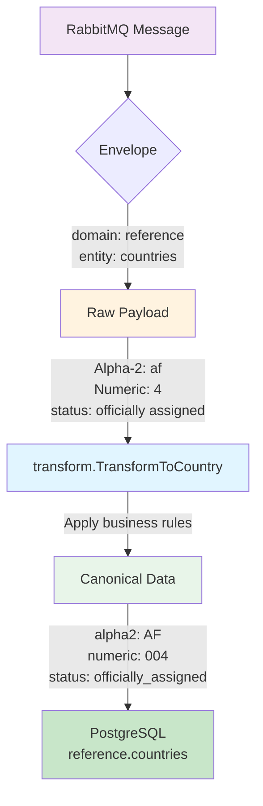

# canonicalizer - Data Transformation and Business Rules Engine

## Purpose

Applies ALL business rules and data transformations before writing to PostgreSQL. This is the ONLY place where data transformation occurs in the Axiom pipeline.

## Philosophy

> "Single source of truth for business rules"

All transformation logic is centralized here. If you need to:

- Pad numeric codes
- Normalize case
- Validate data
- Transform formats
- Apply defaults

**Add it to the canonicalizer**, not csv2json.

## What It Does

The canonicalizer:

1. ✅ Consumes messages from RabbitMQ
2. ✅ Applies domain-specific transformation rules
3. ✅ Validates data against business constraints
4. ✅ Rejects invalid data (with logging)
5. ✅ Writes canonical data to PostgreSQL

## Transformation Rules

For countries module, applies these rules from `modules/reference/countries/internal/transform`:

| Rule | Example |
|------|---------|
| Pad numeric codes | `"4"` → `"004"` |
| Uppercase codes | `"us"` → `"US"` |
| Normalize status | `"officially assigned"` → `"officially_assigned"` |
| Trim whitespace | `"  France  "` → `"France"` |
| Validate required fields | Missing → REJECT |
| Parse dates | `"2020-01-01"` → time.Time |

## Message Flow



## Configuration

### Environment Variables

**Database:**

- `DB_HOST` - PostgreSQL host (default: `localhost`)
- `DB_PORT` - PostgreSQL port (default: `5432`)
- `DB_NAME` - Database name (default: `axiom_db`)
- `DB_USER` - Database user (default: `axiom`)
- `DB_PASSWORD` - Database password (default: `changeme`)
- `DB_SSLMODE` - SSL mode (default: `disable`)

**RabbitMQ:**

- `RABBITMQ_HOST` - RabbitMQ host (default: `localhost`)
- `RABBITMQ_PORT` - RabbitMQ port (default: `5672`)
- `RABBITMQ_USER` - RabbitMQ user (default: `axiom`)
- `RABBITMQ_PASSWORD` - RabbitMQ password (default: `changeme`)
- `RABBITMQ_VHOST` - Virtual host (default: `/axiom`)
- `RABBITMQ_EXCHANGE` - Exchange name (default: `axiom.data.exchange`)

## Building

```bash
go build -o canonicalizer .
```

## Running

```bash
./canonicalizer
```

## Queue Bindings

Currently handles:

- Queue: `axiom.reference.countries`
- Routing Key: `reference.countries`
- Transform: `transform.TransformToCountry()`

## Error Handling

### Valid Data

- Message acknowledged
- Data written to PostgreSQL
- Logged as success

### Invalid Data

- Message rejected (no requeue)
- Error logged with details
- Counter incremented

### Transformation Failures

Common failures:

- Missing required fields
- Invalid status values
- Non-numeric codes
- Invalid date formats

All logged with clear error messages.

## Extending

To add support for new entities:

1. **Add transformation logic** to appropriate module:

   ```go
   // modules/reference/currencies/internal/transform/transform.go
   func TransformToCurrency(raw RawCurrencyData) (*model.Currency, error) {
       // Business rules here
   }
   ```

2. **Add handler** in canonicalizer:

   ```go
   switch envelope.Entity {
   case "countries":
       country, err := transform.TransformToCountry(rawCountry)
       // ...
   case "currencies":
       currency, err := currencyTransform.TransformToCurrency(rawCurrency)
       // ...
   }
   ```

3. **Update queue bindings**:

   ```go
   channel.QueueBind(
       "axiom.reference.currencies",
       "reference.currencies",
       exchange,
       false, nil,
   )
   ```

## Monitoring

### Logs

```
✓ Processed: AF (Afghanistan)
✗ Failed to process message: status is required (cannot default missing data)
Progress: processed=25, rejected=2
```

### Metrics (Future)

- Messages processed
- Messages rejected
- Processing time
- Database write latency

## Testing

Uses the transform package which has 96.4% test coverage:

```bash
# Test transformation logic
cd modules/reference/countries
go test ./internal/transform -v -cover

# Integration test
cd ../../..
./scripts/test-e2e-pipeline.ps1
```

## Architecture Decision

**Why a separate canonicalizer service?**

1. **Separation of Concerns**
   - csv2json: Format conversion
   - canonicalizer: Business rules
   - Database: Data integrity

2. **Reusability**
   - Can add json2json, xml2json, api2json
   - All use same canonicalizer
   - Business rules in one place

3. **Testability**
   - Transform logic fully tested
   - Can test without RabbitMQ/PostgreSQL
   - Clear test boundaries

4. **Flexibility**
   - Easy to add new domains/entities
   - Transformation rules versioned with code
   - Database constraints as safety net

## Related Services

- **csv2json** - Feeds messages to canonicalizer
- **transform package** - Contains transformation logic
- **repository package** - Database operations

## License

Part of the Axiom project.
