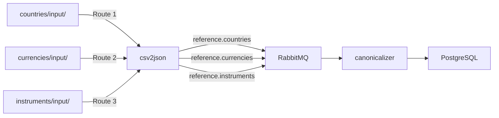

# CSV2JSON Multi-Ingress Routing Configuration

This service implements the **Multi-Ingress Routing Mode** from the base csv2json project, allowing a single service to monitor multiple domain folders and route them independently.

## Architecture



## Benefits

✅ **One Service, Multiple Domains**: Single csv2json container handles all reference data  
✅ **Config-Only Additions**: Add new domains by editing routes.json, no code changes  
✅ **Contract-Based Routing**: Each route has an `ingestionContract` for downstream consumers  
✅ **Independent Folders**: Each domain has its own input/archive/logs structure  
✅ **Operational Simplicity**: Fewer containers, unified monitoring

## Routes Configuration

The service reads [routes.json](routes.json) which defines all monitored domains:

```json
{
  "routes": [
    {
      "name": "countries",
      "ingestionContract": "reference.countries.csv.v1",
      "domain": "reference",
      "entity": "countries",
      "input": {
        "path": "/app/data/reference/countries/input",
        "watchMode": "hybrid",
        "suffixFilter": ".csv"
      },
      "output": {
        "type": "queue",
        "destination": "axiom.data.exchange"
      },
      "archive": {
        "processedPath": "/app/data/reference/countries/archive/processed",
        "failedPath": "/app/data/reference/countries/archive/failed",
        "ignoredPath": "/app/data/reference/countries/archive/ignored"
      }
    }
  ]
}
```

### Route Fields

| Field | Required | Description |
|-------|----------|-------------|
| `name` | ✅ | Unique route identifier (used in logs) |
| `ingestionContract` | ✅ | Schema identifier for downstream consumers |
| `domain` | ✅ | Domain name (e.g., "reference", "trading") |
| `entity` | ✅ | Entity name (e.g., "countries", "currencies") |
| `input.path` | ✅ | Absolute path to monitor for CSV files |
| `input.watchMode` | ❌ | `event`, `poll`, or `hybrid` (default: hybrid) |
| `input.pollIntervalSeconds` | ❌ | Poll mode interval (default: 5) |
| `input.hybridPollIntervalSeconds` | ❌ | Hybrid backup interval (default: 60) |
| `input.suffixFilter` | ❌ | File extensions to process (default: .csv) |
| `output.type` | ✅ | Output destination: `queue`, `file`, or `both` |
| `output.queueDestination` | ⚠️ | RabbitMQ exchange name (required if type=queue/both) |
| `output.fileDestination` | ⚠️ | Output folder path (required if type=file/both) |
| `output.addTimestampSuffix` | ❌ | Add ISO datetime to output filenames (default: false) |
| `archive.processedPath` | ✅ | Where to move successfully processed files |
| `archive.failedPath` | ✅ | Where to move failed files |
| `archive.ignoredPath` | ❌ | Where to move filtered files |
| `logging.logFolder` | ❌ | Route-specific log folder |

### Output Types

The service supports three output modes per route:

- **`queue`**: Send JSON messages to RabbitMQ only
  - Use for production domains where canonicalizer processes immediately
  - Requires `queueDestination` field

- **`file`**: Write JSON to file system only
  - Use for development/testing to inspect raw transformed data
  - Requires `fileDestination` field
  - Output format: JSON array with pretty-printed objects

- **`both`**: Send to RabbitMQ AND write to file
  - Use during development of new domains to verify data before canonicalizer
  - Requires both `queueDestination` and `fileDestination`
  - Files written with ISO datetime suffix if `addTimestampSuffix: true`

**Example output configurations:**

```json
// Production - Queue only
"output": {
  "type": "queue",
  "queueDestination": "axiom.data.exchange",
  "fileDestination": "/app/data/reference/countries/output",
  "addTimestampSuffix": false
}

// Development - Both queue and file with timestamps
"output": {
  "type": "both",
  "queueDestination": "axiom.data.exchange",
  "fileDestination": "/app/data/reference/currencies/output",
  "addTimestampSuffix": true
}

// Testing - File only
"output": {
  "type": "file",
  "queueDestination": "axiom.data.exchange",
  "fileDestination": "/app/data/reference/instruments/output",
  "addTimestampSuffix": true
}
```

**Output filename format:**

- Without timestamp: `countries.json`
- With timestamp: `currencies_20260127_153045.json`

## Folder Structure

Each domain maintains its own folder hierarchy:

```text
modules/reference/
├── countries/
│   └── data/
│       ├── input/              ← Drop countries CSV files here
│       ├── output/             ← JSON output files (if type=file/both)
│       ├── archive/
│       │   ├── processed/
│       │   ├── failed/
│       │   └── ignored/
│       └── logs/
├── currencies/
│   └── data/
│       ├── input/              ← Drop currencies CSV files here
│       ├── output/             ← JSON output files with timestamps
│       ├── archive/
│       │   ├── processed/
│       │   ├── failed/
│       │   └── ignored/
│       └── logs/
└── instruments/
    └── data/
        ├── input/              ← Drop instruments CSV files here
        ├── output/             ← JSON output files
        ├── archive/
        │   ├── processed/
        │   ├── failed/
        │   └── ignored/
        └── logs/
```

**Folder Purposes:**

- **input/**: Monitored for new CSV files
- **output/**: JSON files (when type=file/both) - pretty-printed array format
- **archive/processed/**: Successfully processed CSV files with timestamps
- **archive/failed/**: Failed processing attempts
- **archive/ignored/**: Files filtered by suffix
- **logs/**: Route-specific processing logs
│       │   ├── processed/
│       │   ├── failed/
│       │   └── ignored/
│       └── logs/
├── currencies/
│   └── data/
│       ├── input/              ← Drop currencies CSV files here
│       ├── archive/
│       │   ├── processed/
│       │   ├── failed/
│       │   └── ignored/
│       └── logs/
└── instruments/
    └── data/
        ├── input/              ← Drop instruments CSV files here
        ├── archive/
        │   ├── processed/
        │   ├── failed/
        │   └── ignored/
        └── logs/
```

## Adding a New Domain

### Step 1: Create Folder Structure

```powershell
# Example: Adding currencies domain
mkdir modules/reference/currencies/data/input
mkdir modules/reference/currencies/data/archive/processed
mkdir modules/reference/currencies/data/archive/failed
mkdir modules/reference/currencies/data/archive/ignored
mkdir modules/reference/currencies/data/logs
```

### Step 2: Update routes.json

Add a new route entry to [routes.json](routes.json):

```json
{
  "name": "currencies",
  "ingestionContract": "reference.currencies.csv.v1",
  "domain": "reference",
  "entity": "currencies",
  "input": {
    "path": "/app/data/reference/currencies/input",
    "watchMode": "hybrid",
    "suffixFilter": ".csv"
  },
  "output": {
    "type": "queue",
    "destination": "axiom.data.exchange"
  },
  "archive": {
    "processedPath": "/app/data/reference/currencies/archive/processed",
    "failedPath": "/app/data/reference/currencies/archive/failed",
    "ignoredPath": "/app/data/reference/currencies/archive/ignored"
  }
}
```

### Step 3: Update docker-compose.yml

Uncomment the volume mount:

```yaml
volumes:
  - ./csv2json/routes.json:/app/routes.json:ro
  - ./modules/reference/countries/data:/app/data/reference/countries
  - ./modules/reference/currencies/data:/app/data/reference/currencies  # ← Uncomment
```

### Step 4: Restart Service

```powershell
docker-compose restart csv2json
```

The service will automatically start monitoring the new domain!

## Message Envelope with Ingestion Contract

Each message includes a contract identifier:

```json
{
  "domain": "reference",
  "entity": "countries",
  "timestamp": "2026-01-27T15:30:45Z",
  "source": "csv2json",
  "contract": "reference.countries.csv.v1",
  "payload": {
    "Alpha-2 code": "AF",
    "English short name": "Afghanistan",
    "status": "officially_assigned"
  }
}
```

### Why Ingestion Contracts?

**Contract-based routing** allows downstream consumers (like canonicalizer) to explicitly declare which schemas they support:

```go
// ✅ GOOD: Explicit contract checking
switch msg.Contract {
case "reference.countries.csv.v1":
    processCountriesV1(msg.Payload)
case "reference.currencies.csv.v1":
    processCurrenciesV1(msg.Payload)
default:
    return ErrUnknownContract
}

// ❌ BAD: Inferring from payload shape
if hasField(msg, "Alpha-2 code") {
    // Guessing this is countries data
}
```

**Benefits:**
- 🎯 Safe evolution: Change queue names without breaking consumers
- 📍 Provenance: Track which version of schema was used
- 🚫 No guessing: Services declare "I accept v1" not "I'll try to parse whatever comes"
- 🔄 Schema migration: Support multiple versions simultaneously

## Routing Key Format

Messages are published with routing key pattern: `{domain}.{entity}`

Examples:
- `reference.countries` → Countries data
- `reference.currencies` → Currencies data  
- `reference.instruments` → Instruments data
- `trading.trades` → Trade data

This allows canonicalizer to bind queues with patterns:
- `reference.*` → All reference data
- `*.countries` → Countries from any domain
- `reference.countries` → Specific domain+entity

## Watch Modes

### Hybrid Mode (Recommended for Docker)

```json
{
  "input": {
    "watchMode": "hybrid",
    "hybridPollIntervalSeconds": 60
  }
}
```

- **Primary**: File system events (instant detection)
- **Backup**: 60-second polling (catches missed events)
- **Use case**: Docker volume mounts on Windows/Mac

### Event Mode

```json
{
  "input": {
    "watchMode": "event"
  }
}
```

- Uses fsnotify for OS-level file events
- <100ms detection latency
- Zero CPU when idle
- **Use case**: Linux native filesystems

### Poll Mode

```json
{
  "input": {
    "watchMode": "poll",
    "pollIntervalSeconds": 5
  }
}
```

- Time-based folder scanning
- Works with all filesystems (NFS, SMB, cloud mounts)
- Continuous CPU usage
- **Use case**: Network filesystems

## Testing

### Test Single Domain

```powershell
# Drop a file in countries
cp test-data.csv modules/reference/countries/data/input/

# Watch logs
docker logs -f axiom-csv2json
```

Expected output:
```text
[countries] Processing file: test-data.csv
[countries] ✓ Successfully processed 100 rows from test-data.csv
```

### Test Multiple Domains

```powershell
# Drop files simultaneously
cp countries-test.csv modules/reference/countries/data/input/
cp currencies-test.csv modules/reference/currencies/data/input/

# Watch logs - both routes process concurrently
docker logs -f axiom-csv2json
```

Expected output:
```text
[countries] Processing file: countries-test.csv
[currencies] Processing file: currencies-test.csv
[countries] ✓ Successfully processed 656 rows
[currencies] ✓ Successfully processed 180 rows
```

## Troubleshooting

### Route Not Monitoring

**Check**: Is the route defined in routes.json?
```powershell
docker exec axiom-csv2json cat /app/routes.json
```

**Check**: Is the volume mounted?
```powershell
docker inspect axiom-csv2json | Select-String "Mounts" -Context 0,20
```

### Files Not Processing

**Check**: Does file match suffix filter?
```json
"suffixFilter": ".csv"  // Only processes .csv files
```

**Check**: Is file in correct input folder?
```text
/app/data/reference/countries/input/  ← Must match route config
```

**Check**: Are logs showing the route started?
```powershell
docker logs axiom-csv2json | Select-String "Starting.*monitoring"
```

### Performance Issues

**Symptom**: High CPU usage with many routes

**Solution**: Increase hybrid poll interval
```json
{
  "input": {
    "watchMode": "hybrid",
    "hybridPollIntervalSeconds": 300  // 5 minutes instead of 60s
  }
}
```

## Current Configuration

Active routes:
- ✅ **countries**: `modules/reference/countries/data/input/`
- 🚧 **currencies**: Configured in routes.json, volume mount commented out
- 🚧 **instruments**: Configured in routes.json, volume mount commented out

To activate currencies/instruments, uncomment their volume mounts in [docker-compose.yml](../docker-compose.yml).

---

*Last updated: January 27, 2026*
