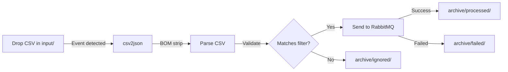

# Countries Data Folder Structure

This folder implements the **file event-based monitoring** pattern from the base csv2json project.

## Folder Structure

```text
data/
├── input/              # DROP NEW CSV FILES HERE (monitored by csv2json)
├── output/             # JSON output files (if OUTPUT_TYPE=file or both)
├── logs/               # csv2json service logs
├── archive/
│   ├── processed/      # Successfully processed CSV files (timestamped)
│   ├── ignored/        # Files that didn't match suffix filter
│   └── failed/         # Files that failed processing
├── countries.csv       # Master source file (for reference)
└── README.md           # This file
```

## How It Works

### File Monitoring (Hybrid Mode)

The csv2json service uses **hybrid watch mode** (recommended for Docker):

- **Primary**: OS file system events (fsnotify) - instant detection
- **Backup**: Periodic polling (60 seconds) - catches missed events

### Processing Flow



### Filename Suffix Filtering

Configured via `FILE_SUFFIX_FILTER` environment variable:

- `.csv` - Only CSV files (default)
- `.csv,.txt` - Multiple extensions
- `*` - All files

### Archive Timestamping

Processed files are automatically timestamped:

```text
countries.csv → countries_20260127_150735.csv
```

## Testing the Pipeline

### Option 1: Drop File While Docker is Running

```powershell
# Start services
docker-compose up

# In another terminal, drop a file
cp countries.csv input/countries_test.csv

# Watch logs
docker logs -f axiom-csv2json
```

### Option 2: Update Test Script

The test script has been updated to use the new folder structure automatically.

```powershell
.\scripts\test-e2e-pipeline.ps1
```

## Configuration

See [docker-compose.yml](../../../docker-compose.yml) for csv2json environment variables:

```yaml
environment:
  WATCH_MODE: hybrid                     # event, poll, or hybrid
  POLL_INTERVAL_SECONDS: 5               # Poll mode interval
  HYBRID_POLL_INTERVAL_SECONDS: 60       # Hybrid backup interval
  INPUT_FOLDER: /app/input
  OUTPUT_FOLDER: /app/output
  ARCHIVE_PROCESSED: /app/archive/processed
  ARCHIVE_IGNORED: /app/archive/ignored
  ARCHIVE_FAILED: /app/archive/failed
  FILE_SUFFIX_FILTER: ".csv"
  OUTPUT_TYPE: queue                     # file, queue, or both
```

## Benefits Over Single-Run Mode

✅ **Continuous Operation**: Service runs 24/7, no manual restarts
✅ **Instant Processing**: Event-driven detection (<100ms latency)
✅ **Reliable Fallback**: Hybrid mode catches missed events
✅ **Audit Trail**: All processed files archived with timestamps
✅ **Separation of Concerns**: Ignored/failed files clearly separated
✅ **Production Ready**: Same pattern as base csv2json project

## Docker Volume Mounting

The folders are mounted in docker-compose.yml:

```yaml
volumes:
  - ./modules/reference/countries/data/input:/app/input
  - ./modules/reference/countries/data/output:/app/output
  - ./modules/reference/countries/data/archive:/app/archive
  - ./modules/reference/countries/data/logs:/app/logs
```

**Windows/Docker Note**: File system events don't reliably propagate from Windows hosts through Docker volume mounts. That's why `WATCH_MODE=hybrid` is the default - the backup polling ensures files are never missed.

---

*Last updated: January 27, 2026*
