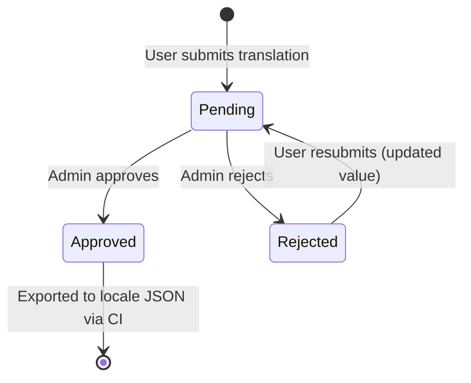

# ADR-0012: Internationalisation (i18n)

**Status:** Accepted
**Date:** 2026-03-10
**Decision Makers:** Engineering Team
**Context:** Axiom Frontend / UX

## Context and Problem Statement

Axiom is a financial services static-data platform used by a globally distributed team. English is
the de-facto working language, but the platform must be accessible to non-English-speaking users.
Specifically:

- The registration / login pages must render in the user's preferred language before they have an
  account (no server-side user record is available at that point).
- Authenticated users must be able to set a persistent language preference that follows them across
  devices.
- A fallback chain (user preference → browser language → English) must ensure a usable UI even
  when translations are incomplete.
- Community contributors must be able to submit new translations for review before they go live, so
  quality is maintained and coordinated with existing translations.
- Approved translations must be loadable automatically (CI/CD), mirroring the existing master-data
  seeding process for countries, currencies, and languages.

## Decision Drivers

- Translations must be available on the login and registration pages before authentication.
- Language selection must persist across sessions via the existing `useUserPreference` system.
- Multiple fallback languages should be configurable to handle partially-translated languages.
- An off-the-shelf library should be used; no bespoke i18n engine.
- A review gate must exist so untranslated or incorrectly translated strings do not appear in
  production.
- The solution must support right-to-left (RTL) scripts (e.g. Arabic).
- Translations must be loadable as daily CI base data, parallel to countries/currencies.

## Options Considered

### Option 1: Browser-native `Intl` API + raw JSON files

**Pros:**

- Zero extra dependencies.
- JSON files are static assets; trivial CDN caching.

**Cons:**

- `Intl` handles number/date formatting only; string translation requires a separate layer.
- No fallback chaining, namespace splitting, or lazy loading out of the box.
- Significant custom code required to replicate features that established libraries provide.

### Option 2: FormatJS / `react-intl`

**Pros:**

- Well-established, widely used in React projects.
- ICU message format for plurals and variables.

**Cons:**

- Heavier bundle than i18next; requires compile-time message extraction.
- Less flexible runtime language switching (requires full component re-render tree).
- Fewer plugins for lazy loading or HTTP-backed locale delivery.

### Option 3: i18next + react-i18next (chosen)

**Pros:**

- Industry-standard; used in thousands of production React/Next.js applications.
- First-class support for: fallback language chains, namespace splitting, lazy/HTTP loading,
  RTL, plurals, interpolation.
- `i18next-browser-languagedetector` handles detection order (localStorage → navigator) out of
  the box.
- `i18next-http-backend` loads locale JSON files from `/public/locales/` with no server-side
  work.
- Aligns with the existing `useUserPreference` hook (language stored as a standard preference).
- Large ecosystem: extraction tools (`i18next-parser`), type safety (`i18next-resources-to-ts`),
  translation management platforms (Crowdin, Lokalise).

**Cons:**

- Additional npm dependencies (`i18next`, `react-i18next`, `i18next-browser-languagedetector`,
  `i18next-http-backend`).
- Locale JSON files are static; dynamic updates require a CDN cache bust or a full re-deploy
  (mitigated by the database-backed review workflow and CI export).

## Decision Outcome

**Chosen Option:** Option 3 – i18next + react-i18next.

### Rationale

i18next provides everything the issue requested without reinventing any wheel:

- Fallback chain (`['en']` hard-coded; user can add a second/third fallback in future config).
- Browser-language detection with localStorage persistence.
- HTTP backend for lazy locale loading (avoids bundling all translations into the JS bundle).
- RTL support via a single `dir` attribute on `<html>` toggled in the `I18nProvider`.

The review workflow adds a database table (`ui_translations`) with
`pending | approved | rejected` states and admin-gated approve/reject actions. Only `approved`
translations are exported into the locale JSON files that i18next consumes, satisfying the
"review before going live" requirement.

### Trade-offs Accepted

- Four new npm packages are added; their combined unpacked size is ~250 KB (before tree-shaking).
- Static JSON locale files must be re-exported (or the CDN cache busted) for updates to appear
  without a deploy. The CI pipeline's daily seed-data run mitigates this for base translations.
- The `useSuspense: false` flag in the i18n config prevents a loading spinner on language switch
  but may cause a brief flash of untranslated strings on very slow connections.

## Consequences

### Positive

- Users see the registration and login pages in their own language immediately.
- Language selection persists cross-device via the `useUserPreference` system.
- Any developer can add a new translation key in under a minute (add to JSON, use `t('key')`).
- Community contributors can submit translations via the admin UI; admins approve before
  publication.
- Approved translations are seeded daily via CI, matching the existing master-data workflow.
- RTL languages (Arabic) are handled automatically via the `dir` attribute.

### Negative

- Static locale files require a deploy (or CI re-export) for translation updates to appear.
- `useSuspense: false` may show brief flashes of English keys on slow connections.
- Each new page/component that needs translation requires explicit `useTranslation()` wiring.

### Mitigation

- The CI nightly seed exports all `approved` translations, minimising the deploy gap.
- A `LoadingSpinner` is shown during the initial i18n initialisation to prevent raw-key flashes.
- The `I18nProvider` wraps the entire app, so `useTranslation()` is always available without
  manual context passing.

## Implementation

### Supported Languages (initial set)

| Code | Name | Native Name | RTL |
| ---- | ---- | ----------- | --- |
| `en` | English | English | No |
| `ar` | Arabic | العربية | Yes |
| `zh` | Chinese (Simplified) | 中文（简体） | No |
| `nl` | Dutch | Nederlands | No |
| `fr` | French | Français | No |
| `de` | German | Deutsch | No |
| `it` | Italian | Italiano | No |
| `ja` | Japanese | 日本語 | No |
| `pt` | Portuguese (Brazilian) | Português (Brasil) | No |
| `es` | Spanish | Español | No |

### Locale File Structure

```text
frontend/public/locales/
  {lng}/
    common.json        # single namespace covering login, register, admin, common chrome
```

Locale files follow the same dot-separated key hierarchy used in `t()` calls:

```json
{
  "login": { "title": "Sign In", "submitButton": "Sign in" },
  "register": { "title": "Request Access" },
  "common": { "save": "Save", "cancel": "Cancel" },
  "admin": { "translations": { "title": "Translations" } }
}
```

### i18n Initialisation (`lib/i18n.ts`)

```ts
import i18n from 'i18next'
import { initReactI18next } from 'react-i18next'
import LanguageDetector from 'i18next-browser-languagedetector'
import HttpBackend from 'i18next-http-backend'

i18n
  .use(HttpBackend)
  .use(LanguageDetector)
  .use(initReactI18next)
  .init({
    lng: getStoredLanguage() ?? undefined,
    fallbackLng: ['en'],
    supportedLngs: ['en', 'fr', 'es', 'de', 'ja', 'ar'],
    defaultNS: 'common',
    backend: { loadPath: '/locales/{{lng}}/{{ns}}.json' },
    detection: {
      order: ['localStorage', 'navigator'],
      lookupLocalStorage: 'axiom_pref::global::language',
    },
    react: { useSuspense: false },
  })
```

### Language Persistence

Language is stored as a standard user preference:

```ts
useUserPreference('global', 'language', 'en')
```

`page_key = 'global'` / `preference_key = 'language'`; follows the same persistence rules as all
other preferences (see [ADR-0011](./adr-0011-user-preferences.md)).

### Database (Translation Review)

Migration `000043_add_ui_translations_table`:

```sql
CREATE TABLE ui_translations (
    id UUID PRIMARY KEY DEFAULT GEN_RANDOM_UUID(),
    translation_key VARCHAR(500) NOT NULL,
    language_code VARCHAR(10) NOT NULL REFERENCES languages (code),
    translation_value TEXT NOT NULL,
    status VARCHAR(20) NOT NULL DEFAULT 'pending'
        CHECK (status IN ('pending', 'approved', 'rejected')),
    notes TEXT,
    submitted_by UUID REFERENCES users (id) ON DELETE SET NULL,
    reviewed_by UUID REFERENCES users (id) ON DELETE SET NULL,
    reviewed_at TIMESTAMPTZ,
    created_at TIMESTAMPTZ NOT NULL DEFAULT NOW(),
    updated_at TIMESTAMPTZ NOT NULL DEFAULT NOW(),
    CONSTRAINT uq_ui_translations_key_language UNIQUE (translation_key, language_code)
);
```

### REST API

| Method | Path | Auth | Description |
| ------ | ---- | ---- | ----------- |
| `GET` | `/api/v1/translations` | Public | List translations (filter by `language`, `status`, `search`) |
| `POST` | `/api/v1/translations` | Authenticated | Submit a translation for review |
| `POST` | `/api/v1/translations/:id/approve` | Admin | Approve a pending translation |
| `POST` | `/api/v1/translations/:id/reject` | Admin | Reject a translation |
| `DELETE` | `/api/v1/translations/:id` | Admin | Delete a translation |

### Translation Review Workflow



### CI / Daily Seed Integration

The CI pipeline runs the same nightly seed job used for countries, currencies, and languages.
For translations, an export step fetches all `approved` rows from `ui_translations` and writes
them into the `frontend/public/locales/{lng}/common.json` files, then commits the result. This
means community-approved translations appear in production without a developer-driven deploy.

## References

- [Internationalisation Guide](../i18n/INTERNATIONALISATION.md)
- [ADR-0006: Next.js and Tailwind Frontend](./adr-0006-nextjs-tailwind-frontend.md)
- [ADR-0011: User Preferences](./adr-0011-user-preferences.md)
- [i18next Documentation](https://www.i18next.com/)
- [react-i18next Documentation](https://react.i18next.com/)
- [ui-patterns.md – Internationalisation section](../ui-patterns.md#internationalisation)
- [i18n init config](../../frontend/app/lib/i18n.ts)
- [LanguageSelector component](../../frontend/app/components/LanguageSelector.tsx)
- [Admin Translations page](../../frontend/app/admin/translations/page.tsx)
- GitHub Issue: [Internationalisation](https://github.com/techie2000/axiom/issues/154)

## Revision History

- **2026-03-10:** Initial decision
