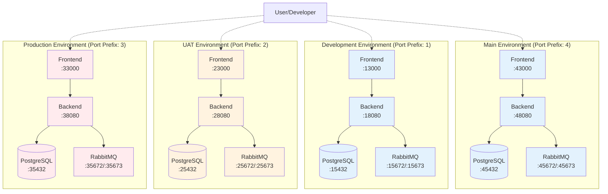

# Multi-Environment Docker Setup

This document describes the multi-environment Docker setup for Axiom, which allows running main, development, UAT,
and production environments simultaneously on the same machine.

## Overview

The Axiom project supports four independent environments, each with its own:

- Database instance (PostgreSQL)
- Message queue (RabbitMQ)
- Backend service
- Frontend service
- Network namespace
- Data volumes

This enables side-by-side comparison and testing across environments without conflicts.

## Architecture Diagram



## Port Assignment Strategy

Each environment uses a unique port prefix to avoid conflicts:

### Main Environment (Prefix: 4)

| Service             | Internal Port | External Port |
|---------------------|---------------|---------------|
| Frontend            | 3000          | 43000         |
| Backend API         | 8080          | 48080         |
| PostgreSQL          | 5432          | 45432         |
| RabbitMQ AMQP       | 5672          | 45672         |
| RabbitMQ Management | 15672         | 45673         |

### Development Environment (Prefix: 1)

| Service             | Internal Port | External Port |
|---------------------|---------------|---------------|
| Frontend            | 3000          | 13000         |
| Backend API         | 8080          | 18080         |
| PostgreSQL          | 5432          | 15432         |
| RabbitMQ AMQP       | 5672          | 15672         |
| RabbitMQ Management | 15672         | 15673         |

### UAT Environment (Prefix: 2)

| Service             | Internal Port | External Port |
|---------------------|---------------|---------------|
| Frontend            | 3000          | 23000         |
| Backend API         | 8080          | 28080         |
| PostgreSQL          | 5432          | 25432         |
| RabbitMQ AMQP       | 5672          | 25672         |
| RabbitMQ Management | 15672         | 25673         |

### Production Environment (Prefix: 3)

| Service             | Internal Port | External Port |
|---------------------|---------------|---------------|
| Frontend            | 3000          | 33000         |
| Backend API         | 8080          | 38080         |
| PostgreSQL          | 5432          | 35432         |
| RabbitMQ AMQP       | 5672          | 35672         |
| RabbitMQ Management | 15672         | 35673         |

## Environment Configuration Files

Each environment has its own configuration file:

- `.env.main` - Main environment variables
- `.env.dev` - Development environment variables
- `.env.uat` - UAT environment variables
- `.env.prod` - Production environment variables

### Configuration Variables

Each `.env` file contains:

```bash
# Project identification
COMPOSE_PROJECT_NAME=axiom-{env}
ENVIRONMENT={env}

# Port mappings
POSTGRES_PORT={prefix}5432
RABBITMQ_PORT={prefix}5672
RABBITMQ_MGMT_PORT={prefix}15672
BACKEND_PORT={prefix}8080
FRONTEND_PORT={prefix}3000

# Database credentials
POSTGRES_USER=axiom
POSTGRES_PASSWORD=axiom_{env}_pass
POSTGRES_DB=axiom_{env}

# Application configuration
JWT_SECRET={env}-secret-change-in-production
SERVER_MODE=debug|release
```

## Docker Compose Files

Each environment has a dedicated Docker Compose file:

- `docker-compose.main.yml` - Main environment
- `docker-compose.dev.yml` - Development environment
- `docker-compose.uat.yml` - UAT environment
- `docker-compose.prod.yml` - Production environment

These files:

- Reference environment variables from corresponding `.env` files
- Create isolated Docker networks
- Use separate volume names for data persistence
- Configure service dependencies and health checks

## Usage

### Starting Environments

```bash
# Start individual environment
make docker-main-up    # Main
make docker-dev-up     # Development
make docker-uat-up     # UAT
make docker-prod-up    # Production

# Start all environments at once
make docker-all-up
```

### Stopping Environments

```bash
# Stop individual environment
make docker-main-down  # Main
make docker-dev-down   # Development
make docker-uat-down   # UAT
make docker-prod-down  # Production

# Stop all environments
make docker-all-down
```

### Viewing Logs

```bash
# View logs for specific environment
make docker-main-logs  # Main
make docker-dev-logs   # Development
make docker-uat-logs   # UAT
make docker-prod-logs  # Production
```

### Checking Status

```bash
# View status of all environments
make docker-all-status
```

### Restarting Services

```bash
# Restart specific environment
make docker-main-restart
make docker-dev-restart
make docker-uat-restart
make docker-prod-restart
```

## Database Migrations

Each environment has its own database, requiring separate migration management:

```bash
# Run migrations
make migrate-main-up   # Main database
make migrate-dev-up    # Development database
make migrate-uat-up    # UAT database
make migrate-prod-up   # Production database

# Rollback migrations
make migrate-main-down # Main database
make migrate-dev-down  # Development database
make migrate-uat-down  # UAT database
make migrate-prod-down # Production database
```

## Accessing Services

### Frontend Applications

- Main: http://localhost:43000
- Development: http://localhost:13000
- UAT: http://localhost:23000
- Production: http://localhost:33000

### Backend APIs

- Main: http://localhost:48080
- Development: http://localhost:18080
- UAT: http://localhost:28080
- Production: http://localhost:38080

### Swagger Documentation

- Main: http://localhost:48080/swagger/index.html
- Development: http://localhost:18080/swagger/index.html
- UAT: http://localhost:28080/swagger/index.html
- Production: http://localhost:38080/swagger/index.html

### Database Connections

```bash
# Main
psql -h localhost -p 45432 -U axiom -d axiom_main

# Development
psql -h localhost -p 15432 -U axiom -d axiom_dev

# UAT
psql -h localhost -p 25432 -U axiom -d axiom_uat

# Production
psql -h localhost -p 35432 -U axiom -d axiom_prod
```

### RabbitMQ Management UI

- Main: http://localhost:45673 (guest/guest)
- Development: http://localhost:15673 (guest/guest)
- UAT: http://localhost:25673 (guest/guest)
- Production: http://localhost:35673 (guest/guest)

## Human-Friendly URLs with Portless (Optional)

The port-prefixed URLs above are functional, but require memorising which prefix belongs to which
environment. [Portless](https://github.com/vercel-labs/portless) is an optional npm tool that maps
stable, named `.localhost` URLs to each service via a lightweight local proxy.

> **This is entirely optional.** Raw `localhost:PORT` URLs continue to work unchanged.

### Quick Setup

```bash
# 1. Install portless globally (once per machine)
npm install -g portless

# 2. Start the proxy (once per session, or configure your shell profile to auto-start)
portless proxy start            # HTTP — URLs become http://<name>.localhost:1355
# or, for fully portless HTTPS:
portless proxy start --https    # HTTPS — URLs become https://<name>.localhost

# 3. Register aliases for all Axiom environments
make portless-setup

# 4. Verify
portless list
```

**Safari** requires one additional step after registering aliases:

```bash
portless hosts sync
```

### Named URLs

After setup, each environment is accessible by name:

| Environment | Service           | Named URL                                    |
|-------------|-------------------|----------------------------------------------|
| main        | Frontend          | `http://axiom-main.localhost:1355`           |
| main        | Backend API       | `http://api.axiom-main.localhost:1355`       |
| main        | RabbitMQ Mgmt     | `http://rabbitmq.axiom-main.localhost:1355`  |
| dev         | Frontend          | `http://axiom-dev.localhost:1355`            |
| dev         | Backend API       | `http://api.axiom-dev.localhost:1355`        |
| dev         | RabbitMQ Mgmt     | `http://rabbitmq.axiom-dev.localhost:1355`   |
| uat         | Frontend          | `http://axiom-uat.localhost:1355`            |
| uat         | Backend API       | `http://api.axiom-uat.localhost:1355`        |
| uat         | RabbitMQ Mgmt     | `http://rabbitmq.axiom-uat.localhost:1355`   |
| prod        | Frontend          | `http://axiom-prod.localhost:1355`           |
| prod        | Backend API       | `http://api.axiom-prod.localhost:1355`       |
| prod        | RabbitMQ Mgmt     | `http://rabbitmq.axiom-prod.localhost:1355`  |

With `portless proxy start --https` the `:1355` suffix disappears entirely.

### Per-Environment Makefile Targets

```bash
make portless-setup           # Register aliases for all environments
make portless-setup-dev       # Register aliases for dev only
make portless-setup-uat       # Register aliases for UAT only
make portless-setup-main      # Register aliases for main only
make portless-setup-prod      # Register aliases for prod only
make portless-list            # Show currently registered aliases
make portless-proxy-start     # Start the HTTP proxy (port 1355)
make portless-proxy-start-https  # Start the HTTPS proxy (port 443)
```

### How It Works

Portless runs a local reverse proxy. The `portless alias <name> <port>` command registers a static
route without requiring portless to start the target process — making it ideal for Docker services
that are already running on fixed ports.

```text
Browser → axiom-dev.localhost:1355 → portless proxy → localhost:13000 → axiom-dev-frontend
Browser → api.axiom-dev.localhost:1355 → portless proxy → localhost:18080 → axiom-dev-backend
```

See [ADR-0013](../adr/adr-0013-portless-human-friendly-urls.md) for the full decision record
including pros, cons, and alternatives considered.

## Container Naming

Containers follow this naming pattern: `axiom-{env}-{service}`

Examples:

- `axiom-main-backend`
- `axiom-dev-backend`
- `axiom-uat-postgres`
- `axiom-prod-frontend`

## Network Isolation

Each environment runs in its own Docker network:

- `axiom-main-network`
- `axiom-dev-network`
- `axiom-uat-network`
- `axiom-prod-network`

This ensures complete isolation between environments.

## Volume Management

Postgres data persistence is environment-specific:

- **main** — bind mount at `./data/main/postgres` on the host (files visible in your file explorer)
- **dev** — bind mount at `./data/dev/postgres` on the host (files visible in your file explorer)
- **uat** — Docker-managed named volume with Compose volume key `postgres_data_uat`
  and actual Docker volume name `${COMPOSE_PROJECT_NAME}_postgres_data_uat`
- **prod** — Docker-managed named volume with Compose volume key `postgres_data_prod`
  and actual Docker volume name `${COMPOSE_PROJECT_NAME}_postgres_data_prod`

This allows each environment to maintain its own persistent data while giving the dev environment
direct filesystem access for easy inspection.

## Common Use Cases

### Testing a Feature Across Environments

```bash
# Start all environments
make docker-all-up

# Deploy feature to dev
# ... build and deploy ...

# Test in dev: http://localhost:13000

# Promote to UAT
# ... build and deploy ...

# Test in UAT: http://localhost:23000

# Compare side-by-side
# Dev: http://localhost:13000
# UAT: http://localhost:23000
```

### Database Comparison

```bash
# Connect to dev database
psql -h localhost -p 15432 -U axiom -d axiom_dev

# In another terminal, connect to UAT database
psql -h localhost -p 25432 -U axiom -d axiom_uat

# Compare schemas, data, etc.
```

### Load Testing Different Environments

```bash
# Run load test against dev
ab -n 1000 -c 10 http://localhost:18080/api/v1/health

# Run load test against UAT
ab -n 1000 -c 10 http://localhost:28080/api/v1/health

# Compare performance metrics
```

## Troubleshooting

### Port Conflicts

If you get port binding errors, check if the ports are already in use:

```bash
# Check if port is in use
lsof -i :18080

# Kill process using the port
kill -9 <PID>
```

### Container Name Conflicts

If you get container name conflicts, ensure you've stopped the previous environment:

```bash
# List all Axiom containers
docker ps -a | grep axiom

# Remove specific container
docker rm -f axiom-dev-backend

# Or stop the entire environment
make docker-dev-down
```

### Volume Issues

If you need to reset an environment's data:

```bash
# Stop the environment
make docker-dev-down

# Remove the bind-mount directory (dev uses a host bind mount, not a Docker volume)
rm -rf ./data/dev/postgres

# Restart the environment
make docker-dev-up

# Run migrations
make migrate-dev-up
```

For UAT or prod (which use Docker-managed volumes):

```bash
# Set the environment: use "uat" or "prod"
ENV=uat

# Stop the environment
make docker-$ENV-down

# Remove the volume
docker volume rm axiom-$ENV_postgres_data_$ENV

# Restart the environment
make docker-$ENV-up

# Run migrations
make migrate-$ENV-up
```

### Viewing All Environment Resources

```bash
# View all containers
docker ps -a | grep axiom

# View all networks
docker network ls | grep axiom

# View dev postgres data (bind mount — host directory)
ls -la ./data/dev/postgres

# View UAT/prod volumes (Docker-managed)
docker volume ls | grep postgres_data
```

## Best Practices

1. **Always use environment-specific commands**: Use `make docker-dev-up` instead of directly calling docker-compose
   to ensure correct configuration
2. **Keep environment variables updated**: If you change passwords or configurations, update the corresponding
   `.env.*` file
3. **Run migrations after environment updates**: Always run migrations when starting a fresh environment or after
   schema changes
4. **Monitor resource usage**: Running multiple environments requires more system resources; monitor CPU and memory
   usage
5. **Clean up unused environments**: Stop environments you're not actively using to free resources
6. **Backup production data**: Even in local development, treat the "prod" environment data as important and back it
   up regularly

## Resource Requirements

Running all four environments simultaneously requires:

- **CPU**: 4+ cores recommended
- **RAM**: 8GB minimum, 16GB recommended
- **Disk**: 10GB+ for Docker images and volumes (note daily raw data file are >1GB, plus database storage)
- **Network**: Each environment uses its own network namespace

## Security Considerations

1. **Change default passwords**: The `.env.*` files contain default passwords; change them for production use
2. **JWT secrets**: Each environment uses a different JWT secret; ensure production secrets are strong and unique
3. **Network isolation**: Environments are isolated by Docker networks; additional firewall rules may be needed for
   production
4. **SSL/TLS**: Consider adding SSL termination for production-like environments

## Future Enhancements

Potential improvements to the multi-environment setup:

- Add staging environment (prefix 5)
- Implement automated environment synchronization
- Add environment-specific CI/CD pipelines
- Integrate with secrets management (Vault, AWS Secrets Manager)
- Add monitoring and alerting per environment
- Implement blue-green deployment per environment
