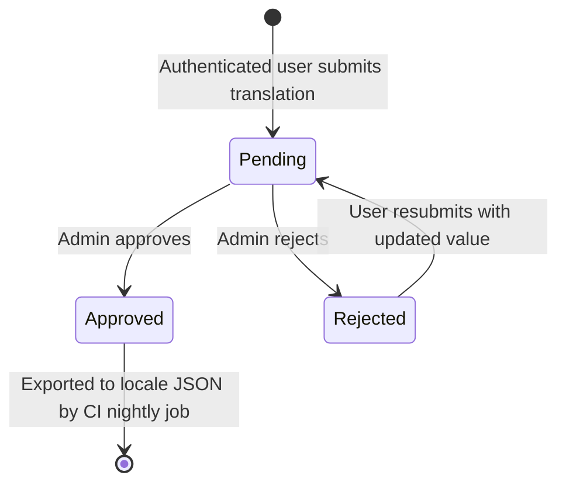

# Internationalisation (i18n) Guide

Axiom's UI is fully internationalised using the **i18next** ecosystem. This guide covers how the
system works, how to add translations, how to wire a new page for i18n, and how the community
translation review workflow operates.

See [ADR-0012](../adr/adr-0012-internationalisation.md) for the architectural decision that led to
this implementation.

## Table of Contents

- [Supported Languages](#supported-languages)
- [How It Works](#how-it-works)
- [Adding a New Translation Key](#adding-a-new-translation-key)
- [Wiring a Page or Component for i18n](#wiring-a-page-or-component-for-i18n)
- [LanguageSelector Component](#languageselector-component)
- [Language Persistence](#language-persistence)
- [RTL Support](#rtl-support)
- [Adding a New Language](#adding-a-new-language)
- [Translation Review Workflow](#translation-review-workflow)
- [Admin Translations UI](#admin-translations-ui)
- [CI / Daily Seed Integration](#ci--daily-seed-integration)
- [Locale File Reference](#locale-file-reference)
- [Troubleshooting](#troubleshooting)

---

## Supported Languages

| Code | Name | Native Name | RTL | Flag |
| ---- | ---- | ----------- | --- | ---- |
| `en` | English | English | No | 🇬🇧 |
| `ar` | Arabic | العربية | Yes | 🇸🇦 |
| `zh` | Chinese (Simplified) | 中文（简体） | No | 🇨🇳 |
| `nl` | Dutch | Nederlands | No | 🇳🇱 |
| `fr` | French | Français | No | 🇫🇷 |
| `de` | German | Deutsch | No | 🇩🇪 |
| `it` | Italian | Italiano | No | 🇮🇹 |
| `ja` | Japanese | 日本語 | No | 🇯🇵 |
| `pt` | Portuguese (Brazilian) | Português (Brasil) | No | 🇧🇷 |
| `es` | Spanish | Español | No | 🇪🇸 |

The canonical source of truth for supported languages is
`frontend/app/lib/i18n.ts` (`SUPPORTED_LANGUAGES` constant).

---

## How It Works

```text
Browser
  ├─ I18nProvider (layout.tsx)
  │    └─ initialises i18next once; sets <html lang> and dir attributes
  │
  ├─ i18next (lib/i18n.ts)
  │    ├─ Detection order: localStorage → browser navigator
  │    ├─ Loads /public/locales/{lng}/common.json via HTTP backend
  │    └─ Falls back to 'en' when a key is missing in the active language
  │
  └─ useTranslation() hook
       └─ t('login.title') → "Sign In" (or translated equivalent)
```

**Detection order** (from highest to lowest priority):

1. Value stored in `localStorage` under key `axiom_pref::global::language`
   (written by `useUserPreference('global', 'language', 'en')`).
2. Browser's `navigator.language` header.
3. English fallback.

---

## Adding a New Translation Key

1. Open `frontend/public/locales/en/common.json` (the English source of truth).
2. Add the key in the appropriate namespace section:

```json
{
  "myFeature": {
    "myNewKey": "English text here"
  }
}
```

1. Add the same key to all other locale files (`fr`, `es`, `de`, `ja`, `ar`) with the
   translated value. If you do not have a translation, copy the English string – i18next will
   use the English fallback automatically, but having the key present avoids a console warning.
2. Use the key in the component with `t('myFeature.myNewKey')`.

---

## Wiring a Page or Component for i18n

### Step 1 – Import i18n and the hook

```tsx
'use client'

import '../../lib/i18n'            // initialises i18next (idempotent, safe to import multiple times)
import { useTranslation } from 'react-i18next'

export default function MyPage() {
  const { t } = useTranslation()

  return <h1>{t('myFeature.myNewKey')}</h1>
}
```

### Step 2 – Avoid calling `t()` outside the component body

`useTranslation()` is a React hook; call it at the top of the component function, not inside
callbacks, render helpers, or module-level code.

```tsx
// ✅ CORRECT
const { t } = useTranslation()
const label = t('common.save')

// ❌ WRONG – called outside component
const label = t('common.save')  // t is not available at module scope
```

### Step 3 – Pass `t` into helper functions

If you have a standalone helper that needs translated strings, pass `t` as an argument:

```tsx
function myHelper(value: string, t: (key: string) => string) {
  return t(`status.${value}`)
}

// Usage inside component
const { t } = useTranslation()
const label = myHelper('active', t)
```

---

## LanguageSelector Component

`frontend/app/components/LanguageSelector.tsx` renders a flag + native-name dropdown. Drop it
into any page header.

```tsx
import LanguageSelector from '../components/LanguageSelector'

// Standard (shows flag + native language name)
<LanguageSelector />

// Compact (shows flag + language code only)
<LanguageSelector compact />

// With additional CSS
<LanguageSelector className="ml-auto" />
```

The selector:

- Updates i18next immediately (no page reload).
- Writes the choice to `localStorage` under `axiom_pref::global::language`.
- Calls `setStoredLanguage` via `useUserPreference` to persist the preference to the server when
  the user is authenticated.

---

## Language Persistence

Language is stored as a standard Axiom user preference:

| Field | Value |
| ----- | ----- |
| `page_key` | `global` |
| `preference_key` | `language` |
| `default` | `en` |

This means it follows the same persistence rules as all other preferences
(see [ADR-0011](../adr/adr-0011-user-preferences.md)):

- **Pre-login / unauthenticated**: stored in `localStorage` only.
- **Authenticated**: persisted to the server; roams across devices.

To read or write the language preference programmatically:

```tsx
import { useUserPreference } from '../lib/useUserPreference'

const [language, setLanguage] = useUserPreference('global', 'language', 'en')
```

---

## RTL Support

The `I18nProvider` (`frontend/app/components/I18nProvider.tsx`) listens for language changes and
sets `document.documentElement.lang` and `document.documentElement.dir` automatically:

```ts
document.documentElement.lang = languageCode   // e.g. 'ar'
document.documentElement.dir = isRtl ? 'rtl' : 'ltr'
```

Tailwind's `rtl:` variant utilities work automatically when `dir="rtl"` is set on `<html>`. Use
`rtl:` prefixed classes for layout elements that must mirror in RTL:

```tsx
<div className="ml-4 rtl:ml-0 rtl:mr-4">…</div>
```

---

## Adding a New Language

1. Add the language entry to `SUPPORTED_LANGUAGES` in `frontend/app/lib/i18n.ts`:

```ts
{ code: 'ko', name: 'Korean', nativeName: '한국어', rtl: false, flag: '🇰🇷' }
```

1. Create the locale file `frontend/public/locales/ko/common.json` with translated strings
   (copy from `en/common.json` and translate).
2. Ensure the language code exists in the `languages` reference table in the database (it is
   referenced by the `ui_translations` table FK).
3. The `LanguageSelector` picks up the new language automatically from `SUPPORTED_LANGUAGES`.

---

## Translation Review Workflow

Any authenticated user can submit new or updated translations. An admin must approve them before
they are served to the frontend.



### REST API

| Method | Path | Auth | Description |
| ------ | ---- | ---- | ----------- |
| `GET` | `/api/v1/translations` | Public | List translations; filter by `language`, `status`, `search` |
| `POST` | `/api/v1/translations` | Authenticated | Submit a translation for review |
| `POST` | `/api/v1/translations/:id/approve` | Admin | Approve a pending translation |
| `POST` | `/api/v1/translations/:id/reject` | Admin | Reject a translation |
| `DELETE` | `/api/v1/translations/:id` | Admin | Delete a translation permanently |

### Submitting a translation (POST body)

```json
{
  "translation_key": "login.title",
  "language_code": "pt",
  "translation_value": "Entrar",
  "notes": "Standard Brazilian Portuguese sign-in label"
}
```

### Database table

`ui_translations` (migration `000043`):

| Column | Type | Description |
| ------ | ---- | ----------- |
| `id` | UUID | Surrogate primary key |
| `translation_key` | VARCHAR(500) | Dot-separated i18next key (e.g. `login.title`) |
| `language_code` | VARCHAR(10) | ISO 639-1 code; FK → `languages.code` |
| `translation_value` | TEXT | Translated string |
| `status` | VARCHAR(20) | `pending`, `approved`, or `rejected` |
| `notes` | TEXT | Reviewer / submitter notes |
| `submitted_by` | UUID | FK → `users.id` |
| `reviewed_by` | UUID | FK → `users.id` |
| `reviewed_at` | TIMESTAMPTZ | Timestamp of approval / rejection |
| `created_at` | TIMESTAMPTZ | Submission time |
| `updated_at` | TIMESTAMPTZ | Last modification time |

Unique constraint: `(translation_key, language_code)` – one active translation per key per
language.

---

## Admin Translations UI

Navigate to **Admin → Translations** (`/admin/translations`) to:

- Browse all submitted translations with language, status, and free-text filters.
- Approve or reject pending translations.
- Submit new translations directly (saved as `approved` by an admin).
- Delete translations.

The page is protected by the `AdminRequired` middleware; regular users are redirected.

---

## CI / Daily Seed Integration

The nightly CI seed job (same pipeline that loads countries, currencies, and languages) includes
an export step:

1. Queries `ui_translations WHERE status = 'approved'` grouped by `language_code`.
2. Merges the results into `frontend/public/locales/{lng}/common.json`.
3. Commits the changes back to the repository.

This ensures that community-approved translations appear in production without a developer-driven
deploy, matching the issue's requirement for *"CI that would see newly added/amended translations
appear as base data that gets loaded daily"*.

---

## Locale File Reference

All six locale files live in `frontend/public/locales/`. Each is a JSON object with the following
top-level namespaces:

| Namespace | Coverage |
| --------- | -------- |
| `nav` | Navigation links |
| `login` | Login page |
| `register` | Registration / request-access page |
| `register_success` | Post-registration confirmation |
| `language` | Language selector labels |
| `theme` | Dark/light theme toggle |
| `common` | Shared UI verbs (Save, Cancel, Delete…) |
| `admin.translations` | Admin translations management page |
| `footer` | Footer text |

---

## Troubleshooting

### Keys displayed as raw strings (e.g. `login.title`)

- The locale JSON file failed to load. Check the browser network tab for a 404 on
  `/locales/{lng}/common.json`.
- Ensure the file exists in `frontend/public/locales/{lng}/common.json`.
- Confirm the key path in the JSON matches the argument passed to `t()`.

### Language selector not appearing

- Confirm `I18nProvider` wraps the component tree (it is added in `layout.tsx`).
- Ensure `'use client'` is set on the page or component that calls `useTranslation()`.

### RTL layout not applying

- Check that `I18nProvider` has mounted and set `dir="rtl"` on `<html>`.
- Ensure you are using Tailwind `rtl:` variant classes rather than hardcoded `ltr`-only
  layout utilities.

### Language preference not persisting after login

- Confirm `useUserPreference('global', 'language', 'en')` is initialised in `LanguageSelector`.
- Check the `PUT /api/v1/preferences` response in the network tab for errors.
- The preference is stored under `axiom_pref::global::language` in `localStorage` as a fallback.

---

## Related Documentation

- [ADR-0012: Internationalisation](../adr/adr-0012-internationalisation.md)
- [ADR-0011: User Preferences](../adr/adr-0011-user-preferences.md)
- [UI Patterns Guide – i18n section](../ui-patterns.md#internationalisation)
- [i18next Documentation](https://www.i18next.com/)
- [react-i18next Documentation](https://react.i18next.com/)
