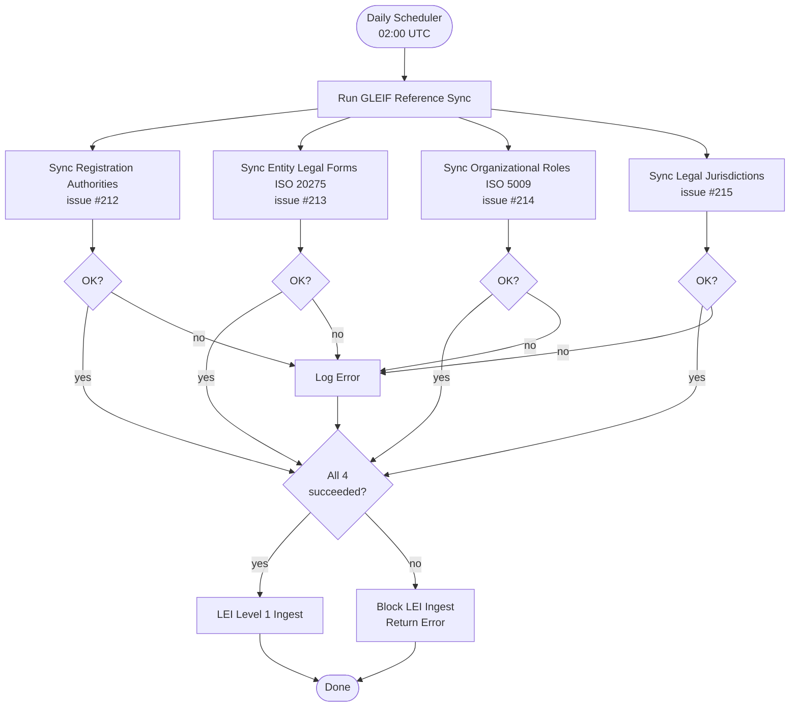

# GLEIF Reference Code Lists

This document describes the four GLEIF reference code lists ingested before
LEI Level 1/2 data processing, as required by issues #212–#215.

## Overview

LEI records contain coded reference values (registration authority ID, entity legal
form code, legal jurisdiction code, organizational role code) that must be resolved
to human-readable names for display in the UI. The reference code lists are sourced
daily from GLEIF CSV endpoints and stored in the `lei_raw` schema.

The pipeline enforces **reference-data-first** ordering: all four code lists are
fully upserted before any LEI Level 1/2 ingest begins.

## Processing Flow



## Code Lists

### 1. GLEIF Registration Authorities (issue #212)

- **Source**: GLEIF Registration Authorities List CSV (tab-separated)
- **Table**: `lei_raw.gleif_registration_authorities`
- **Key column**: `ra_id` (e.g. `RA000001`)
- **Resolves**: `lei_raw.lei_records.registration_authority`
- **Update strategy**: Full replace — `DeactivateAll()` then upsert all rows
- **URL**: `https://www.gleif.org/content/2-about-lei/6-code-lists/2-gleif-registration-authorities-list/`

### 2. Entity Legal Forms — ISO 20275 (issue #213)

- **Source**: ISO 20275 Entity Legal Forms CSV (tab-separated)
- **Table**: `lei_raw.gleif_entity_legal_forms`
- **Key column**: `elf_code` (e.g. `2HBR`)
- **Resolves**: `lei_raw.lei_records.entity_legal_form`
- **Update strategy**: Full replace — `DeactivateAll()` then upsert all rows (sets status to `DECOMMISSIONED`
  for removed rows)
- **URL**: `https://www.gleif.org/content/2-about-lei/6-code-lists/1-iso-20275-entity-legal-forms/`

### 3. Official Organizational Roles — ISO 5009 (issue #214)

- **Source**: ISO 5009 Organizational Roles CSV (tab-separated)
- **Table**: `lei_raw.gleif_organizational_roles`
- **Key column**: `role_code` (e.g. `GENERAL_PARTNER`)
- **Resolves**: Relationship role codes in LEI Level 2 data
- **Update strategy**: Full replace — `DeactivateAll()` then upsert all rows
- **URL**: `https://www.gleif.org/content/2-about-lei/6-code-lists/4-iso-5009-official-organizational-roles/`

### 4. Accepted Legal Jurisdictions (issue #215)

- **Source**: GLEIF Accepted Legal Jurisdictions List CSV (tab-separated)
- **Table**: `lei_raw.gleif_legal_jurisdictions`
- **Key column**: `jurisdiction_code` (e.g. `US-CA`, `DE`)
- **Update strategy**: Full replace — `DeactivateAll()` then upsert all rows
- **URL**: `https://www.gleif.org/content/2-about-lei/6-code-lists/3-gleif-accepted-legal-jurisdictions/`

## Database Schema

The four tables live in the `lei_raw` schema and share a common structure:

```sql
CREATE TABLE lei_raw.gleif_registration_authorities (
    id               UUID PRIMARY KEY DEFAULT GEN_RANDOM_UUID(),
    ra_id            VARCHAR(50)  NOT NULL UNIQUE,
    organization_name VARCHAR(500) NOT NULL,
    jurisdiction     VARCHAR(100),
    international_name VARCHAR(500),
    languages_used   VARCHAR(100),
    website          VARCHAR(500),
    comments         TEXT,
    active           BOOLEAN NOT NULL DEFAULT TRUE,
    created_by       VARCHAR(100) NOT NULL DEFAULT 'system',
    updated_by       VARCHAR(100) NOT NULL DEFAULT 'system',
    created_at       TIMESTAMPTZ NOT NULL DEFAULT NOW(),
    updated_at       TIMESTAMPTZ NOT NULL DEFAULT NOW()
);
```

See migration `backend/migrations/000048_add_gleif_reference_tables.up.sql`
for the complete DDL for all four tables.

## UI Enrichment

The LEI repository resolves reference codes to human-readable names via correlated
subqueries at query time. No denormalization is stored in `lei_records`.

```sql
-- Example: resolved names added to each LEI record query
(SELECT ra.organization_name
   FROM lei_raw.gleif_registration_authorities ra
  WHERE BTRIM(ra.ra_id) = BTRIM(lei_records.registration_authority)
    AND ra.active = TRUE
  LIMIT 1) AS registration_authority_name,

(SELECT elf.entity_legal_form_name
   FROM lei_raw.gleif_entity_legal_forms elf
  WHERE BTRIM(elf.elf_code) = BTRIM(lei_records.entity_legal_form)
  LIMIT 1) AS entity_legal_form_name
```

The resolved names are returned in the `LEIRecord` JSON response as:

| JSON field | Source code field | Reference table |
| --- | --- | --- |
| `registration_authority_name` | `registration_authority` | `gleif_registration_authorities` |
| `entity_legal_form_name` | `entity_legal_form` | `gleif_entity_legal_forms` |

The LEI Records UI page (`frontend/app/lei-records/page.tsx`) displays the resolved
name alongside the raw code, falling back gracefully when the reference table has
not yet been seeded.

> **Note**: The `gleif_legal_jurisdictions` reference table is available for future
> jurisdiction resolution. The raw `LegalJurisdiction` field in GLEIF data is not
> currently stored in `lei_raw.lei_records` — a separate enrichment layer will be
> introduced if jurisdiction name resolution is required.

## Manual Trigger

A manual sync endpoint is available for operational use:

```http
POST /api/v1/lei/sync/gleif-reference
Authorization: Bearer <jwt>
```

The endpoint triggers an asynchronous sync of all four lists and returns immediately.
Progress can be observed in the application logs.

## Error Handling and Observability

- Each list is synced independently; a failure in one does not block the others.
- Errors are logged with `zerolog` at `ERROR` level with `list` and `err` fields.
- Successful syncs log the record count at `INFO` level.
- Malformed CSV rows are skipped with a `WARN` log entry per row.
- The scheduler records `GLEIF_REFERENCE_SYNC` job status in
  `lei_raw.file_processing_status` for dashboard visibility.

## Common Requirements

All four lists satisfy the requirements defined in the epic:

1. ✅ **JSON → CSV preference**: CSV is the only official GLEIF format for code lists.
2. ✅ **Daily scheduled sync** with robust upsert/deactivate behaviour.
3. ✅ **Reference-data-first**: sync runs before any LEI Level 1/2 ingest.
4. ✅ **UI name resolution**: resolved names appear in LEI summary and detail views.
5. ✅ **Audit/observability**: zerolog structured logging + job status tracking.
6. ✅ **Documentation** updated inline with the LEI implementation docs.
