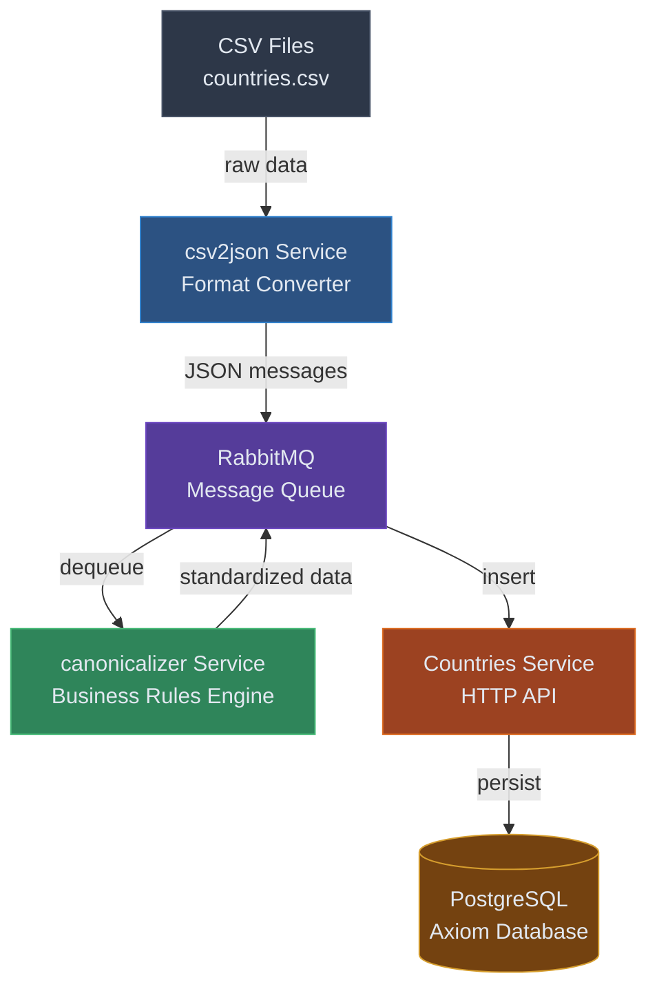
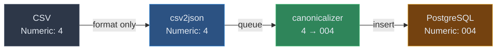
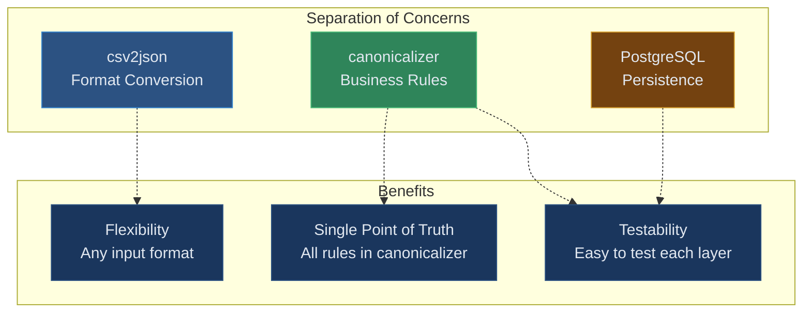
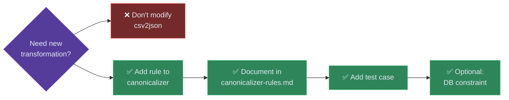

# Axiom Data Pipeline Architecture

## Overview



## Layer Responsibilities

### 1. csv2json (Format Converter)

**Purpose**: Convert CSV files to JSON messages for RabbitMQ

**Does**:

- ✅ Read CSV files
- ✅ Convert rows to JSON objects
- ✅ Wrap in message envelope (domain, entity, timestamp)
- ✅ Publish to RabbitMQ exchange

**Does NOT**:

- ❌ Transform data values
- ❌ Validate data
- ❌ Apply business rules
- ❌ Clean or normalize data

**Input**:

```csv
English short name,French short name,Alpha-2 code,Alpha-3 code,Numeric
Afghanistan,Afghanistan (l'),AF,AFG,4
```

**Output** (exactly as received):

```json
{
  "domain": "reference",
  "entity": "countries",
  "timestamp": "2026-01-26T10:30:00Z",
  "source": "csv2json",
  "payload": {
    "English short name": "Afghanistan",
    "French short name": "Afghanistan (l')",
    "Alpha-2 code": "AF",
    "Alpha-3 code": "AFG",
    "Numeric": "4"
  }
}
```

**Note**: Numeric is `"4"` (as in CSV), not `"004"`

---

### 2. RabbitMQ (Message Queue)

**Purpose**: Decouple csv2json from canonicalizer

**Does**:

- ✅ Queue messages for processing
- ✅ Handle backpressure
- ✅ Provide delivery guarantees
- ✅ Dead-letter queue for failures

**Does NOT**:

- ❌ Modify messages
- ❌ Validate data
- ❌ Transform content

---

### 3. canonicalizer (Business Rules Engine)

**Purpose**: Apply ALL data transformations and business rules

**Does**:

- ✅ **Pad numeric codes**: `"4"` → `"004"`
- ✅ **Normalize case**: `"us"` → `"US"`
- ✅ **Trim whitespace**: `" France "` → `"France"`
- ✅ **Transform aliases**: `"officially assigned"` → `"officially_assigned"` (space to underscore)
- ✅ **Validate data**: Check required fields, formats, constraints
- ✅ **Reject invalid data**: Missing required fields → reject record
- ✅ **Map field names**: `"Alpha-2 code"` → `"alpha2"`
- ✅ **Standardize data**: Ensure consistency across all sources

**Does NOT**:

- ❌ Just pass data through
- ❌ Trust incoming data is correct

**Input** (from csv2json):

```json
{
  "Numeric": "4",
  "Alpha-2 code": "af"
}
```

**Output** (standardized):

```json
{
  "numeric": "004",
  "alpha2": "AF"
}
```

**Critical**: This is the **ONLY** place business rules are applied. All transformation logic lives here.

---

### 4. PostgreSQL (Data Persistence + Safety Net)

**Purpose**: Store canonical data and enforce final constraints

**Does**:

- ✅ Store validated data
- ✅ Enforce database constraints (safety net)
- ✅ Provide ACID guarantees
- ✅ Reject invalid data that bypasses canonicalizer

**Does NOT**:

- ❌ Transform data (that's canonicalizer's job)
- ❌ Should rarely reject data (canonicalizer validates first)

**Constraints**:

```sql
CONSTRAINT numeric_format CHECK (numeric ~ '^[0-9]{3}$')
```

If canonicalizer works correctly, this should never fail in production.

---

## Data Flow Example

### Scenario: CSV contains `"4"` for Afghanistan's numeric code



**Key Points**:

1. CSV contains raw data: `"4"`
2. csv2json preserves it: `"4"` in JSON
3. **canonicalizer transforms it**: `"4"` → `"004"`
4. PostgreSQL stores canonical form: `"004"`

---

## Why This Architecture?



## Adding New Rules



**Wrong**: Add transformation to csv2json  
**Right**: Add transformation to canonicalizer + document in `canonicalizer-rules.md`

**Example**: Need to uppercase country codes?

1. ❌ Don't modify csv2json
2. ✅ Add rule to canonicalizer
3. ✅ Document in `docs/canonicalizer-rules.md`
4. ✅ Add test case
5. ✅ (Optional) Add database constraint as safety net

---

### Separation of Concerns

- **csv2json**: One job - format conversion (reusable for any CSV)
- **canonicalizer**: One job - business rules (domain-specific)
- **PostgreSQL**: One job - persistence (data integrity)

### Single Point of Truth

- **All** business rules in canonicalizer
- Easy to find, test, and maintain
- No "which layer handles this?" confusion

### Flexibility

- Can replace csv2json with json2json, xml2json, api2json
- canonicalizer handles all transformations regardless of source
- Business rules independent of input format

### Testability

- csv2json: Test format conversion only
- canonicalizer: Test transformations and business rules
- Database: Test constraints

---

## Adding New Rules

**Wrong**: Add transformation to csv2json
**Right**: Add transformation to canonicalizer + document in `canonicalizer-rules.md`

**Example**: Need to uppercase country codes?

1. ❌ Don't modify csv2json
2. ✅ Add rule to canonicalizer
3. ✅ Document in `docs/canonicalizer-rules.md`
4. ✅ Add test case
5. ✅ (Optional) Add database constraint as safety net
