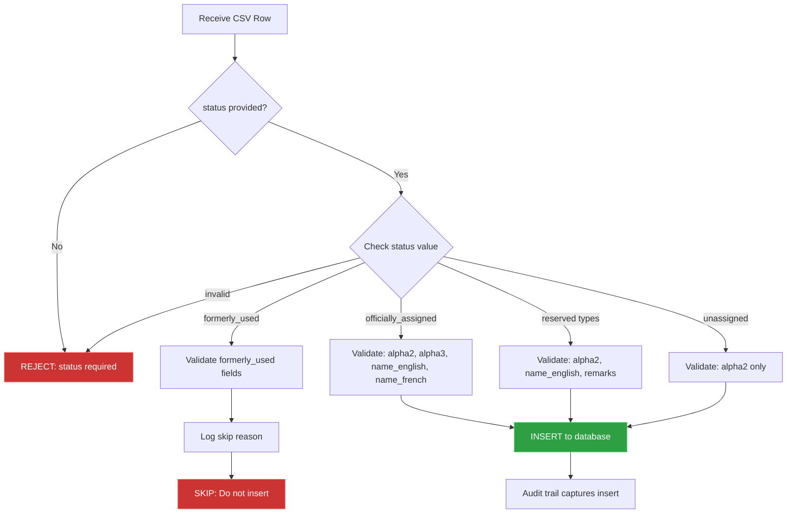

# Country Data Validation Rules

This document defines the business rules for validating and processing ISO 3166-1 country data based on status type.

## Overview

ISO 3166-1 defines six status types for country codes. Each status has specific field requirements that must be enforced during data ingestion.

**Related ADR**: [ADR-007: Exclude Formerly Used Country Codes](../../../docs/adrs/007-exclude-formerly-used-country-codes.md)

## Status-Specific Rules

### 1. Officially Assigned (`officially_assigned`)

Active country codes currently in use.

**Required Fields:**
- `status` (must be "officially_assigned")
- `alpha2` (2-letter code, e.g., "US")
- `alpha3` (3-letter code, e.g., "USA")
- `name_english` (official English name)
- `name_french` (official French name, per ISO requirement)

**Optional Fields:**
- `numeric` (3-digit numeric code)
- `start_date` (when code was assigned)
- `end_date` (should be NULL for active codes)
- `remarks`

**Examples:**
```csv
alpha2,alpha3,numeric,name_english,name_french,status
US,USA,840,United States of America,États-Unis d'Amérique,officially_assigned
GB,GBR,826,United Kingdom of Great Britain and Northern Ireland,Royaume-Uni de Grande-Bretagne et d'Irlande du Nord,officially_assigned
```

### 2. Exceptionally Reserved (`exceptionally_reserved`)

Codes reserved at the request of international organizations (e.g., UN, EU) for specific purposes.

**Required Fields:**
- `status` (must be "exceptionally_reserved")
- `alpha2`
- `remarks` (explains why code is reserved)

**Optional Fields:**
- `name_english` (not always provided for exceptional reservations)
- `name_french`
- `start_date`
- `end_date`

**Examples:**
```csv
alpha2,name_english,status,remarks
EU,European Union,exceptionally_reserved,"Reserved at the request of ISO 4217/MA (March 1998) for ISO 6166, Securities - International securities identification numbering system (ISIN)."
UN,United Nations,exceptionally_reserved,Reserved at the request of the United Nations Statistics Division.
```

### 3. Indeterminately Reserved (`indeterminately_reserved`)

Codes reserved without a specific end date or defined criteria for removal.

**Required Fields:**
- `status` (must be "indeterminately_reserved")
- `alpha2`
- `name_english`
- `remarks`

**Optional Fields:**
- `start_date`
- `end_date`

**Examples:**
```csv
alpha2,name_english,status,remarks
AC,Ascension Island,indeterminately_reserved,Reserved for UPU purposes.
CP,Clipperton Island,indeterminately_reserved,Reserved for ITU purposes.
```

### 4. Transitionally Reserved (`transitionally_reserved`)

Codes that are commonly used but not officially assigned (e.g., UK instead of GB).

**Required Fields:**
- `status` (must be "transitionally_reserved")
- `alpha2`
- `name_english`
- `remarks`

**Optional Fields:**
- `start_date`
- `end_date`

**Examples:**
```csv
alpha2,name_english,status,remarks
UK,United Kingdom,transitionally_reserved,Reserved transitionally for use by the United Kingdom. Code GB is officially assigned.
EW,England and Wales,transitionally_reserved,Reserved for use by the European Union.
```

### 5. Formerly Used (`formerly_used`)

Historical codes that are no longer in use but may be reused in the future.

**⚠️ THESE RECORDS ARE NOT INSERTED INTO THE DATABASE** (per ADR-007)

**Required Fields (for validation only):**
- `status` (must be "formerly_used")
- `alpha2`
- `alpha3`
- `numeric`
- `name_english`
- `name_french`
- `start_date`
- `end_date`
- `remarks`

**Processing:**
- Canonicalizer validates the record
- Record is **skipped** (not inserted into database)
- Event is logged with reason: `"Skipped formerly_used code per ADR-007"`

**Examples (will be skipped):**
```csv
alpha2,alpha3,numeric,name_english,name_french,status,start_date,end_date,remarks
GE,GEL,296,Gilbert and Ellice Islands,Îles Gilbert et Ellice,formerly_used,1974-01-01,1979-12-31,Code reassigned to Georgia (GE/GEO/268) in 1992.
YU,YUG,891,Yugoslavia,Yougoslavie,formerly_used,1974-01-01,2003-07-14,Code ceased after country dissolved.
```

### 6. Unassigned (`unassigned`)

Two-letter combinations that have not been assigned to any country or entity.

**Required Fields:**
- `status` (must be "unassigned")
- `alpha2`

**Optional Fields:**
- `remarks`

**Examples:**
```csv
alpha2,status,remarks
ZZ,unassigned,Reserved for user assignment.
AA,unassigned,Not allocated by ISO 3166/MA.
```

## Validation Flow



## Database Constraints

The following CHECK constraints enforce these rules at the database level:

```sql
-- Rule 1: officially_assigned requires alpha2, alpha3, name_english, name_french
ALTER TABLE reference.countries 
    ADD CONSTRAINT chk_officially_assigned_fields CHECK (
        status != 'officially_assigned' OR (
            alpha2 IS NOT NULL 
            AND alpha3 IS NOT NULL 
            AND name_english IS NOT NULL 
            AND name_french IS NOT NULL
        )
    );

-- Rule 2: exceptionally_reserved OR indeterminately_reserved require alpha2, name_english, remarks
ALTER TABLE reference.countries 
    ADD CONSTRAINT chk_reserved_fields CHECK (
        status NOT IN ('exceptionally_reserved', 'indeterminately_reserved') OR (
            alpha2 IS NOT NULL 
            AND name_english IS NOT NULL 
            AND remarks IS NOT NULL
        )
    );

-- Rule 3: transitionally_reserved requires alpha2, name_english, remarks
ALTER TABLE reference.countries 
    ADD CONSTRAINT chk_transitionally_reserved_fields CHECK (
        status != 'transitionally_reserved' OR (
            alpha2 IS NOT NULL 
            AND name_english IS NOT NULL 
            AND remarks IS NOT NULL
        )
    );

-- Rule 4: formerly_used should never exist (filtered by canonicalizer)
ALTER TABLE reference.countries 
    ADD CONSTRAINT chk_no_formerly_used CHECK (
        status != 'formerly_used'
    );

-- Rule 5: unassigned requires only alpha2
ALTER TABLE reference.countries 
    ADD CONSTRAINT chk_unassigned_fields CHECK (
        status != 'unassigned' OR (
            alpha2 IS NOT NULL
        )
    );
```

## Canonicalizer Implementation Checklist

- [x] Add `Remarks` field to Country model
- [x] Parse `remarks` column from CSV
- [x] Validate status is always provided
- [x] Implement status-specific validation functions:
  - [x] `validateOfficiallyAssigned()`
  - [x] `validateExceptionallyReserved()`
  - [x] `validateIndeterminatelyReserved()`
  - [x] `validateTransitionallyReserved()`
  - [x] `validateFormerlyUsed()` (then skip insert)
  - [x] `validateUnassigned()`
- [x] Skip `formerly_used` records with logging
- [x] Add metrics for skipped records by status
- [x] Update integration tests for all status types
- [x] Update error messages to reference ADR-007

## Testing Strategy

Each status type must have:
1. Valid example that passes validation
2. Invalid example missing required fields
3. Edge case examples (empty strings, NULL values)

For `formerly_used`:
- Valid record that is correctly skipped
- Invalid record that is rejected before skip

## References

- [ISO 3166-1 Glossary](https://www.iso.org/glossary-for-iso-3166.html)
- [ADR-007: Exclude Formerly Used Country Codes](../../../docs/adrs/007-exclude-formerly-used-country-codes.md)
- [Database Schema Migration 003](../migrations/003_add_remarks_and_relax_constraints.up.sql)
